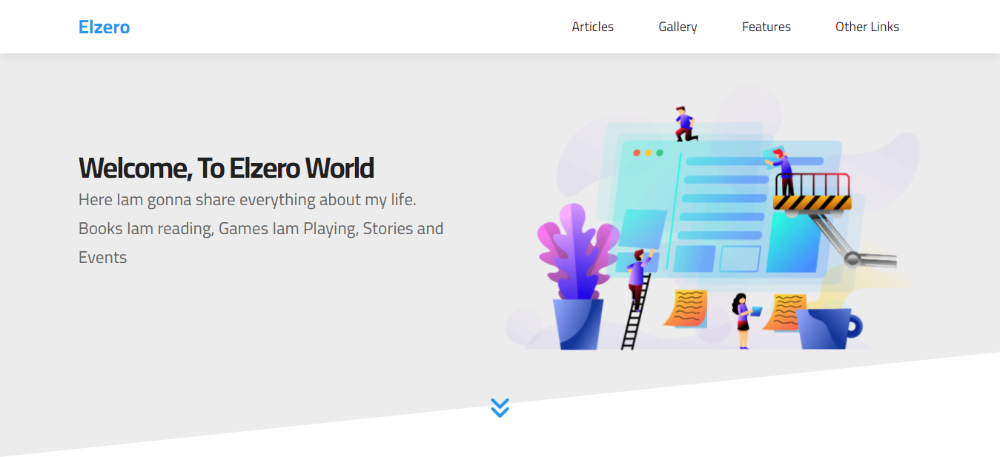

# Elzero Tutorials: template (3)

These is solution for personal website (landing) page tutorial assignment by Osama Elzero

## Screenshot



## Demo

https://abubakr404.github.io/elzero-tut-temp-3/


## Run Locally

Clone the project

```bash
  git clone https://github.com/abubakr404/elzero-tut-temp-3.git
```

Go to the project directory

```bash
  cd template_3
```

Install dependencies

```bash
  npm install
```

Start the server

```bash
  npm run start
```


## Lessons Learned & challenge 

I was Learned how to automated my work with task runner like Gulp js


## My process

### Built with

- Semantic HTML5 markup
- CSS custom properties
- Flexbox
- CSS Grid
- Mobile-first workflow
- SASS
- Javascript 
- Pugjs
- Gulpjs
- Nodejs


## Authors

- [@abubakr hisham](https://www.github.com/abubakr404)


## Related

Here are some related projects

[Elzero Tutorials: template (1)](https://github.com/abubakr404/elzero-tut-temp-1/)

[Elzero Tutorials: template (2)](https://github.com/abubakr404/elzero-tut-temp-2/)


## Support

For support, email abubakr404@outlook.com.


## Feedback

If you have any feedback, please reach out to us at abubakr404@outlook.com
